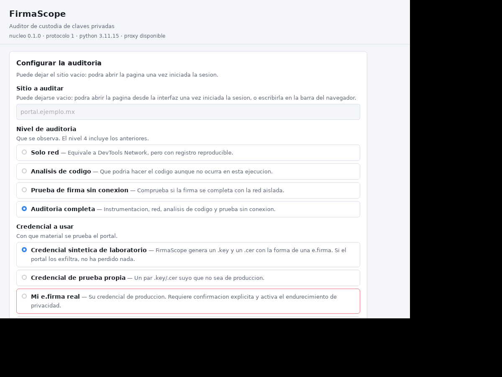

# Interfaz gráfica de FirmaScope

Una ventana de control junto al navegador auditado. La interfaz **no audita**:
lanza el núcleo de Python como proceso hijo y le pasa mensajes.

```text
  ┌─────────────────┐   JSON por línea    ┌──────────────────────┐
  │  Tauri (Rust)   │ ◄── stdin/stdout ──►│  firmascope (Python) │
  │  ventana + IPC  │                     │  todo el criterio    │
  └─────────────────┘                     └──────────┬───────────┘
                                                     │ Playwright/CDP
                                          ┌──────────▼───────────┐
                                          │ Chromium instrumentado│
                                          │ (el operador lo usa)  │
                                          └──────────────────────┘
```



El operador interactúa con **dos** ventanas: esta, que dice en qué etapa está y
qué se ha observado, y el Chromium instrumentado, donde carga su `.key` y firma.
La interfaz nunca rellena el formulario del portal: si lo hiciera, estaría
auditando un flujo que no es el que seguirá un usuario real.

## Por qué stdio y no un puerto local

Lo habitual sería que el núcleo levantara un servidor HTTP en `localhost`. Aquí
sería una mala idea: FirmaScope maneja la e.firma del operador, y un puerto
abierto es alcanzable por **cualquier página que el usuario tenga abierta en
cualquier navegador**. Bastaría una petición desde un sitio cualquiera para
arrancar una sesión o leer el estado de la que está en marcha.

Con stdio no hay superficie: el proceso lo lanza la interfaz como hijo y sólo
ella puede escribirle. Es también lo que permite que la contraseña de la clave
viaje por el canal sin pasar por la red ni por la línea de comandos.

### La excepción: el panel

`firmascope panel` sirve **esta misma interfaz** (`src/firmascope/ui/`, la que
empaqueta Tauri) en `127.0.0.1`, para usarla en el navegador sin compilar nada.
Es otro transporte del mismo puente, con el riesgo de un puerto local: lo
mitigan un código de un solo uso en la URL, un token por sesión en `X-FS-Token`,
la comprobación de `Host` y de origen y una CSP `'self'`, y el panel avisa del
riesgo al arrancar y en la página. Las condiciones están en `CLAUDE.md` y en
`firmascope/gui_bridge/panel.py`; las pruebas de `tests/test_panel.py` hablan
HTTP con él como lo haría un atacante.

## Por qué la interfaz no decide nada

Los campos, sus dependencias, las validaciones y los estados de conclusión salen
del esquema que publica el núcleo (`firmascope.audit_core.options`). El mismo
esquema lo pinta el asistente de la CLI: añadir una opción allí la hace aparecer
en las dos interfaces sin tocar ninguna.

Si la interfaz replicara parte de ese criterio habría **dos verdades** sobre la
misma auditoría, y la que viera el operador no sería necesariamente la que
quedara en el expediente.

## Compilar

Requiere Rust y, en Linux, las cabeceras de WebKitGTK:

```bash
# Debian/Ubuntu
sudo apt install libwebkit2gtk-4.1-dev build-essential curl file libssl-dev \
                 libayatana-appindicator3-dev librsvg2-dev

cd gui/src-tauri
cargo build --release
```

El binario queda en `gui/src-tauri/target/release/firmascope-gui`.

## Ejecutar

La interfaz busca el núcleo en este orden:

| Variable | Para qué |
|---|---|
| `FIRMASCOPE_PYTHON` | intérprete a usar (por omisión `python3`) |
| `FIRMASCOPE_PYTHONPATH` | `PYTHONPATH` del hijo, para un árbol de fuentes |

```bash
# Con FirmaScope instalado con pip
./target/release/firmascope-gui

# Desde el árbol de fuentes
FIRMASCOPE_PYTHONPATH=../../src ./target/release/firmascope-gui
```

Si el núcleo no arranca, la interfaz lo dice y ofrece reintentar, en lugar de
quedarse en blanco.

## El protocolo

Una línea JSON por mensaje, petición y respuesta emparejadas:

```json
{"id": "7", "cmd": "validate", "args": {"answers": {...}}}
{"id": "7", "ok": true, "result": {"problems": [], "visible": [...]}}
```

Comandos: `hello`, `schema`, `validate`, `rules`, `start`, `action`, `poll`,
`navigate`, `network`, `live`, `live_options`, `status`, `finish`, `report`,
`shutdown`, y `login_start` / `login_save` / `login_cancel` para iniciar sesión
en el portal antes de auditar. El inicio de sesión va en dos comandos porque el
puente atiende uno por vez y no puede bloquearse esperando a la persona; la
contraseña de la cuenta se escribe en el navegador y nunca pasa por el puente.
Están documentados en `firmascope/gui_bridge/bridge.py`.

Los eventos de la auditoría **no se empujan**: la interfaz los pide con `poll`
cada 700 ms. Así todo ocurre en un solo hilo —el mismo que controla Playwright,
que no admite otro— y el orden de la cadena de evidencias queda determinado por
quien pregunta, no por una carrera entre sensores.

`hello` compara la versión de protocolo. Un núcleo más nuevo que la interfaz que
lo lanza es un error de empaquetado, y es mejor descubrirlo al arrancar que a
mitad de una auditoría con la clave ya cargada.

## Pruebas

`tests/test_gui.py` carga esta misma interfaz en un Chromium real y conecta su
transporte al puente ejecutándose como proceso hijo, igual que lo lanza Tauri.
Cubre toda la cadena salvo la capa de Rust, que no contiene criterio.

```bash
PYTHONPATH=src python3 -m pytest tests/test_gui.py -q
```

Lo que se comprueba no es que la interfaz «se vea bien», sino que no tenga su
propia idea de la auditoría: que los campos salgan del esquema, que las
validaciones sean las del núcleo y que las etapas las decida su máquina.
